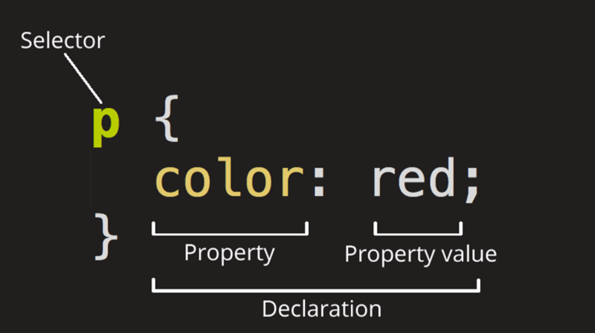
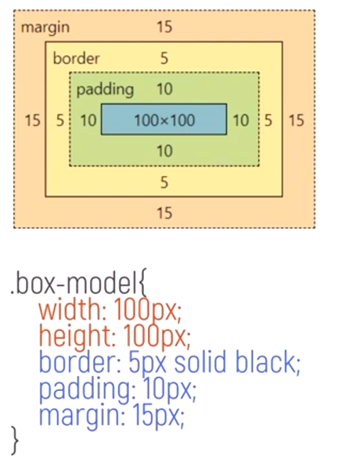
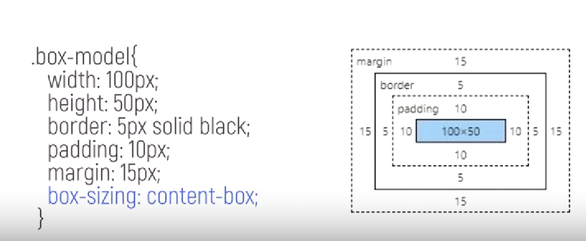
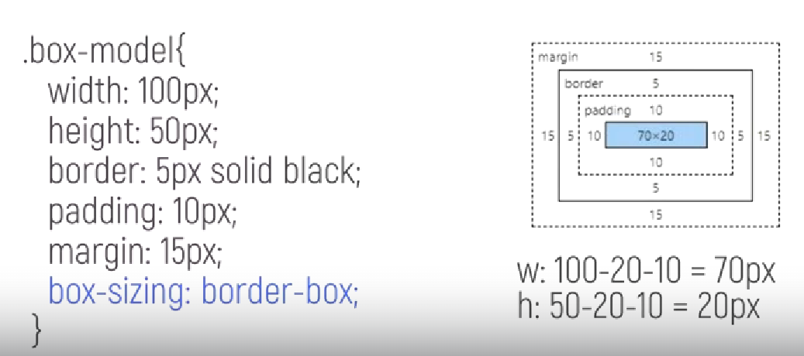
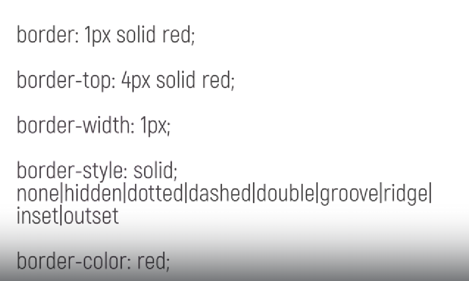
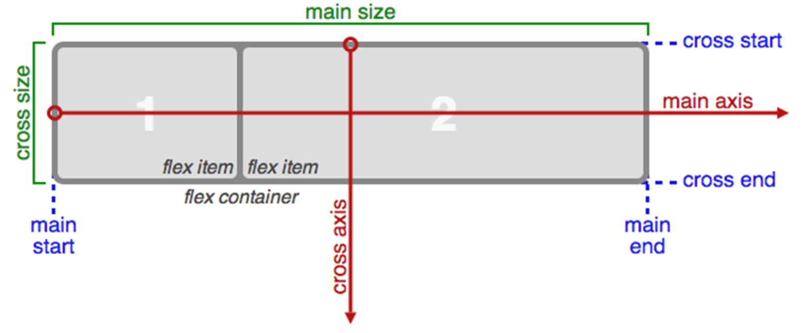

# CSS

## Основы. Синтаксис.

CSS - язык таблицы стилей, код для стилизации разметки.

CSS можно писать:
1) в элементе styles в файле .html
2) во внешнем файле, при это в .html нужно указать <link rel="stylesheet" href="css/main.css">
3) в атрибуте style каждого элемента, но это считается плохой практикой из-за сложности переопределения стилей.


Анатомия набора правил CSS

### Общие правила

* Каждый набор правил, кроме селектора, должен быть обернут в '{}';
* В каждом объявлении необходимо использовать ':', чтобы отделить свойство от его значений;
* В каждом наборе правил нужно использовать ';', чтобы отделить каждое объявление от следующего.

### Типы селекторов

```css
h1 { /*...*/ }          - селектор по тегу
#el_id { /*...*/ }      - селектор по id
.class_name { /*...*/ } - селектор по классу
h1[class] { /*...*/ }   - селектор по атрибуту (все элементы с указанным атрибутом)
.link:hover { /*...*/ } - селектор псеводкласса (элемент в случае определенного состояния, например, наведение курсора)
```

### Каскад 

Каскад - порядок следования элементов в CSS имеет значение.

**Когда используются два и более правила, имеющие одинаковую специфичность, используется последнее из них.** 

```css
h1 {
    font-size: 20px;
    color: red;
}
h1 {
    color: blue
}
```
```html
<h1>This is blue with font-size 20px</h1>
```

### Специфичность 

Специфичность определяет какое правило применяется, когда несколько правил имеют разные селекторы, но тем не менее могут быть применены к одному и тому же элементу.

**Вес селекторов**:
1) id; 1.0.0
2) классы, атрибуты, псевдоклассы; 0.1.0
3) теги, псевдоэлементы; 0.0.1

Комбинаторы +, >, ~, уникательный селектор * и псевдокласс where{} веса не имеют.

Атрибут style перебивает любые селекторы, т.е. он самый специфичный.

Ключевое слово !important перебивает все стили, использовать аккуратно (если компонент взят из другой библиотеки)
```css
h1 {
    color: blue !important;
}
```

### Наследование

Наследование в CSS - способность элементов-потомков перенимать свойства их предков. 

#### Контроль наследования 

##### inherit
Не все свойства элементов наследуются автоматически. В том случае, если нам нужно унаследовать какое-либо свойство, нужно прописать это явно:
```css
div {
    border: 2px solid red;
}
img {
    border: inherit; /* Включаем наследование */
}
```

##### initial

У каждого свойства в CSS есть значение по умолчанию. Ключевое слово initial используется для задания значения по умолчанию для свойства элемента.

```css
p {
    font-size: 20px;
    color: red;
}
.special {
    color: initial;
}
```
```html
<p>Текст красного цвета, 20px</p>
<p class="special">Текст черного цвета, 20px</p>
```

##### unset 

Unset устанавливает свойство равным значению по умолчанию, если оно наследуется от родительского элемента. В противном случае (наследуется естественным образом) - устанавливает свойство равным inherit.

### Порядок выбора CSS-правил:

1) Важность (!important)
2) Специфичность
3) Порядок следования

## Блочные и строчные элементы CSS

Типы отображения:
* Каждый блок в CSS имеет внешний тип отображения, который определяет, блочный он или строчный. 
* Элементы также имеют внутренний тип отображения, который определяет расположение элементов внутри них.

Display (виды отображения):
1) Блочные
    * block
    * flex
    * grid
2) Строчные
    * inline
    * inline-block
    * inline-flex
    * inline-grid

### Виды элементов 

#### Блочные (block)

* Начинаются с новой строки;
* Заполняют все пространство, доступное в контейнере;
* Применяются свойства ширина и высота;
* Внешние и внутренние отступы и рамка будут отодвигать от него другие элементы.

#### Строчные (inline)

* Не начинается с новой строки;
* Не применяются свойства ширина и высота;
* Вертикальные внешние и внутренние отступы и рамки будут применяться, но не будут отодвигать другие строчные элементы.
* Горизонтальные внешние и внутренние отступы и рамки будут применяться и будут отодвигать другие строчные элементы.

#### Inline-block

Золотая середина между block и inline. **Полезно, когда нужно, чтобы элемент не переносился на новую строку**.

* Применяются свойства ширина и высота;
* Использование border, padding, margin приведет к тому, что другие элементы будут отодвинуты от элемента;
* Он не перенесется на новую строку и станет больше, чем его содержимое, только если явно задать ширину и высоту.

### Блочная модель



Важно заметить, что margin не учитывается при подсчете размера объекта.

#### Стандартная блочная модель (box-sizing: content-box)

Если указать элементу ширину и высоту, то это определит ширину и высоту содержимого.
Любые отступы и рамки затем добавляются к этой ширине и высоте для получения общего размера элемента.

width + padding * 2 + border * 2
heigth + padding * 2 + border * 2



#### Альтернативная блочная модель (box-sizing: border-box)

При использовании данной модели, ширина - это ширина видимой части элемента на странице.
То есть размер содержимого уже включает в себя внутренний отступ и рамку.
Ширина области содержимого = общая ширина - ширина рамки - ширина внутреннего отступа(padding).



#### CSS Правило

По стандарту браузеры используют стандартную блочную модель. В связи с этим могут возникать неприятности, когда элемент верстки занимает больше места, чем ожидается.
Поэтому нужно менять блочную модель на альтернативную на всей веб-странице.

```css
html {
    box-sizing: border-box;
}

*, *::before, *::after {
    box-sizing: inherit;
}
```

#### Margin

Margin - невидимое пространство вокруг элемента (может быть отрицательным). Оно отталкивает другие элементы от него.

Описывается либо с помощью конкретизации (margin-top, margin-right и т.д.), либо с помощью margin: top, right, bottom, left (сверху и по кругу). 

**Схлопывание** - если у двух элементов margin положительные и соприкасаются, то два этих значения буду объединены в одно

#### Padding 

Padding - внутренний отступ (не может быть отрицательынм).

Описывается либо с помощью конкретизации (padding-top, padding-right и т.д.), либо с помощью padding: top, right, bottom, left (сверху и по кругу). 

#### Border


v

## Селекторы

### Виды селекторов 

#### По Тегу

Применяется, когда нужно переопределить какие-то стандартные стили браузера. Чаще всего он располагается в самом начале css файла. 
В основном селектор по тегу используется для сброса CSS-стилей, установленных по умолчанию в браузерах, чтобы создать чистый лист для дальнейшей стилизации.
В остальных случаях использование не рекомендуется.

```css
html {
    box-sizing: border-box;
}

*, *::before, *::after {
    box-sizing: inherit;
}
```

#### По ID

Не рекомендуется часто использовать этот селектор, он имеет очень высокую специфичность.
Нежелательно злоупотреблять им в верстке, это может привести к проблемам с масштабированием и огромным таблицам стилей.

```css
#main {
    padding: 0;
    margin: 0;
}
```

#### По Классу

Самый часто используемый тег в CSS. 
Позволяет определить стили для элементов, которые имеют один класс.

#### Селектор потомка

Цепочка перечисленных через пробел означает вложенность, которая идет от родительского элемента к потомку. 
Это позволяет управлять стилями вложенных элементов. Вложенный селектор имеет больший вес, чем селектор из одного класса.
Из-за этого гораздо легче придумать новый класс, чем использовать вложенность.

Лучше всего не повышать специфичность элементов для простоты переопределения элементов в будущем. 

```css
#main a {
    color: blue;
    text-decoration: none;
}
/* Вместо селектора потомка лучше использовать селектор по классу: */
.link-default {
    color: blue;
    text-decoration: none;
}
```

#### Универсальный селектор \*

Универсальный селектор соответствует любому тегу, но не включает псевдоэлементы ::before, ::after.
Нередко используется для изменения алгоритма расчета размеров перед началом верстки. 
Однако, не рекомендуется использовать его слишком часто, это может привести к необходимости переопределения свойств, заданных с его помощью.

```css 
.article * {
    font-size: 20px;
}

* {
    box-sizing: border-box;
}
```

#### По атрибуту 

Находит элементы по значению, либо по наличию атрибута.

```css 
[disabled] {
    opacity: 0.3;
}

[href="#"] {
    color: red;
}
```

В селекторе по атрибуту есть разные вариации и операторы:
* [alt~="текст"] ищет все элементы, у которого атрибут - перечень слов, разделенных пробелом. Ищет слово со значением value; 
* [href^="https://"] выберет все элементы, у которых атрибут attr начинается с value;
* [href$="/about"] выберет все элементы, у которых атрибут attr заначивается на value;
* [href*="/auth/"] выберет все элементы, у которых атрибут attr содержит значение value;

### Практические приемы использования селекторов 

Перечисление селекторов поможет избежать дублирования кода:

```css 
.primary,
.primary ol,
.primary ul,
.article {
    position: relative;
    display: flex;
    color: blue;
}
```

#### Комбинирование селекторов 

##### Объединение

Применяется только для классов и атрибутов, т.к. их может быть одного.
Селекторы записываются слитно и стили будут применены только к тому элементу, который содержит все перечисленные селекторы.

```css
.text.text-book {
    color: red;
}

<p class="text text-book">Этот текст красный</p>
```

##### Вложенные селекторы

Последовательность селекторов отражает непосредственную вложенность. 
Элемент справа - прямой потомок (именно прямой!), слева - родитель

```css 
.blog > p {

}
```

##### Смежные селекторы

Элемент справа от знака + должен следовать за элементом слева от знака +, при этом имеет значение есть ли на пути другие элементы. 
Стили будут применены только к правому элементу.

```css
/* Все элементы p, кроме первого до первого элемента другого вида*/
.blog p + p
```

##### Последующие селекторы

Элемент справа от знака ~ должен следовать за элементом слева от знака ~, при этом не важно есть ли на его пути другие элементы. 

```css
/* Все элементы p, кроме первого */
.blog p ~ p
```

#### БЭМ 

1) Стили строятся плоско, практически без уровней вложенности;
2) Каждому элементу в html задается свой класс;
3) Строить стили так, чтобы у всех стилей была одна специфичность.

## Псевдоклассы и псевдоэлементы

### Псевдоэлементы

Псевдоэлементы - это элементы, которые не существуют в HTML-разметке, но создаются и позиционируются при помощи CSS-стилей. Они используются для создания и оформления различных декоративных элементов:
* ::before;
* ::after;
* ::selection - изменяет цвет выделенного пользователем текста;
* ::placeholder - стилизуют соответствующие элементы;
* ::first-line, ::first-letter - позволяет задать стиль первой строки текста/первой буквы первой строки, расположенной в блочном элементе;

before и after имеют обязательное свойство content для текста, который необходимо вставить до или после элемента
По умолчанию являются строчными элементами.

```css
.elem::before {
    content: ":)";
}
```

К псевдоэлементам часто обращаются, когда нужно затемнить фон:
```css
.dark-wrapper::after {
    content: "";
    position: absolute;
    background-color: rgb(0 0 0 / 40%)
}
```

### Псевдоклассы

Псведоклассы пишутся через одинарное двоеточие, задают стиль элемента в определенном состоянии, например, при наведении на него мышкой или при наличии атрибута disabled.

* :hover - стиль элемента при наведении на него мышки;
* :link - неоткрытые ссылки;
* :visited - открытые ссылки (по которым уже переходили);
* :active - элемент, с которым происходит взаимодействие сейчас;
* :focus - меняет внешний вид элемента в фокусе (например, добавляет рамку, чтобы можно было пользоваться сайтом без мышки);
* :*-child - группа элементов для выбора элементов по их порядковому номеру внутри родительского элемента;
* :*-of-type - группа, схожая с группой child, но порядок не сбивается из-за вложенности;
* :not - позволяет выбрать элементы, которые не соответствуют определенному селектору;
* input псевдоклассы:
    * :checked - активируется, когда пользователь нажимает checkbox или выбирает радиокнопку;
    * :disabled - для disabled полей;
    * :readonly - для readonly полей.
* :root - псевдокласс, который представляет корневой элемент. Правила, определенные в этом псевдоклассе, становятся глобальными.  

## Типографика

Типографика в CSS отвечает за оформление текста на веб-странице. Это включает в себя выбор шрифтов, размеров, цветов, интерлиньяжа, кернинга и других параметров, которые влияют на внешний вид текста.

* font-family: задает шрифт текста, можно указать несколько шрифтов через запятую. Последним шрифтом лучше всего указывать стандартный шрифт (serif - с засечками, sans-serif - без засечек, monospace - моноширинный), чтобы в случае невозможности подгрузить кастомный, подгружался он.
* font-size: задает размер шрифта.
* font-weight: задает жирность шрифта, можно использовать значения от 100 до 900, где 400 - обычный, а 700 - жирный.
* line-height: задает интерлиньяж, то есть расстояние между строками текста.
* letter-spacing: задает кернинг, то есть расстояние между буквами.
* text-indent: задает отступ первой строки текста в элементе.
* color: задает цвет текста.
* text-align: задает направление текста. ( left (start), center, right (end), justify )
* text-transform: свойство может применяться для преобразования всего текста в верхний или нижний регистр, а также для капитализации первой буквы каждого слова.
    * text-transform: uppercase;
    * text-transform: lowercase;
    * text-transform: capitalize;
    * text-transform: none;

**Для подключения кастомных дизайнерских шрифтов можно использовать директиву @font-face**.

**Также шрифты можно подгрузить из google fonts (https://fonts.google.com/):**
```html
<link href="https://fonts.googleapis.com/css2?family=Roboto:ital,wght@0,100;0,300;1,100&display=swap" rel="stylesheet">
<style>
    body {
        font-family: 'Roboto', sans-serif;
    }
</style>
```

## Функции и переменные CSS

### Функции CSS

* calc - позволяет вычислять значения свойств на основе математических действий.
    * в скобках как минимум у одного числа должны быть указаны единицы измерения;
    * в качестве единиц измерения можно использовать встроенные в css единицы: rem, em, px и т.д.;
    * операторы сложения и вычитания должны иметь пробел с обоих сторон.

* min, max - позволяют выбрать наибольшее/наименьшее значение из списка: min(70%, 800px)

* clamp - позволяет задать значение, которое будет меняться в определенных пределах. Функция принимает три параметра: минимальное, предпочтительное и максимальное значения. 

### CSS-переменные

В начале названия переменной ставится два тире. Правило не обязательное, но делают так все. 
Переменные вызываются с помощью ключевого слова var. 
Любая переменная может быть переопределена. Учитывается та переменная, которая находится ниже всего.
Если значение переменной может быть не определено, то через запятую лучше всего передать запасное значение var(--c1, black)

```css
:root {
    --primary-color: red;
}

.post-wrapper {
    --primary-color: black;
    --title-color: orange;
}

.post-title {
    color: var(--title-color, var(--primary-color, black))
}

.post-text {
    color: var(--primary-color);
}
```

С помощью CSS переменных можно очень просто сделать **темную тему сайта**, они позволяют задавать значения цветов и других свойств единожды и затем использовать в разных местах кода. При переключении на темную тему можно изменить значения переменных, и все элементы на странице автоматически изменят свой цвет на темный.

## Flexbox и flex-элементы

Flexbox - это один из наиболее эффективных способов расстановки, выравнивания и распределения места между элементами внутри контейнера, даже если их размер неизвестен или динамичен.

Основная цель flexbox – это **возможность изменения элементов по ширине и высоте для того, чтобы они максимально эффективно умещались в доступном месте родительского контейнера**. Это удобно в тех случаях, когда нужно соответствовать всем типам дисплеев устройств и размерам экранов.



Основные правила flexbox:

* display: flex | inline-flex; 
    * flex - превращает элемент в контейнер flexbox, который позволяет управлять размещением дочерних элементов внутри него;
    * inline-flex - делает то же самое, но также превращает элемент в строчный контейнер flexbox, который может быть встроен в текстовую строку.

* flex-direction: row (-reverse) | column (-reverse); - главной осью становится X или Y.

* flex-wrap: wrap | nowrap | wrap-reverse ; - будет ли элемент переноситься на следующую строчку(столбец) или будет сжиматься? 

* justify-content - **выравнивание вдоль главной оси (не всегда X!)** (flex-start  | flex-end | center | space-between | space-around | space-evenly);
    * space-between - равномерное распределение по строке, при этом первый элемент в начале, а последний - в конце;
    * space-evenly - все отстпы, включая отступы от начала main и конца main равны;
    * space-around - отступ от main начала и конца равен половине отступа элементов друг от друга.

* align-items - **выравнивание вдоль поперечной оси (не всегда Y!)** . Отвечает в целом за выравнивание элементов в контейнере. (flex-start | flex-end | center | baseline | stretch);
    * stretch - по умолчанию, заполняют контейнер с учетом минимальной и максимальной ширины;
    * baseline - элементы выравниваются по базовой линии;

* align-content - **выравнивает строки контейнера**, когда есть пространство в поперечной оси. **Отвечает за расстояние между рядами**. (flex-start | flex-end | center | stretch | space-between | space-around);

* gap - отступы между элементами grid и flexbox;

* order - задает порядковый номер элемента;

* flex-grow - определяет, насколько элемент будет растягиваться в контейнере. Если 0, то разширяться элементу запрещено, если 1, то разрешено;

* flex-shrink - на сколько элемент может уменьшаться. Если 0, то нельзя уменьшаться, если 1, то можно;

* flex-basis - определяет начальный размер элемента до применения flex-shrink | flex-grow (т.е. до распределения свободного пространства);

* min- и max- width - минимальная и максимальная ширина элемента в контейнере, на случай его разрастания/уменьшения;

* align-self, justify-self - выравнивание для конкретного элемента контейнера;

* margin-* : auto; - в данном случае все пространство контейнера разделится на равные части между отступами элементов, у которых задано свойство.

Короткая запись для flex-grow, flex-shrink и flex-basis:
```css
.container {
    flex: 0 1 auto;
}
```

Короткая запись для flex-direction и flex-wrap:
```css
.conteiner {
    flex-flow: row wrap;
}
```

## Grid 

CSS Grid - это инструмент для создания сеточной структуры веб-страницы с помощью CSS. Он позволяет разбивать страницу на строчки и колонки, чтобы расположить элементы контента на странице в соответствии с заданными правилами. Используются для сложных, многоколончатых макетов, используют двумерную сетку, в отличие от flexbox.

**Свойства сетки грид:**
* display: grid (inline-grid) - размещение элементов в любом направлении/в строчном направлении
* grid-template-columns, grid-template-rows: 1fr 1fr 1fr 1fr - задают колонки и строки;
* grid-template - сокращение для grid-template-rows / grid-template-columns;
* grid-row, grid-columns - располагают элементы внутри строк и колонок;

fr (fractional unit) - единица гибкости.
Если было исопльзовано что-то помимо fractal, то fractal заполняет все свободное пространство

**Полезные функции:**
* repeat(n, value) - повторить value n раз (repeat(4, 1fr) = 1fr 1fr 1fr 1fr);
* minmax(min, max) - задает диапазон значений для свойств, которые определяют размеры элементов (minmax(0, 1fr) - не менее 0 и не более 1fr); 

**Свойства элемента грида:**
* grid-column-start, grid-column-end (row) - начальная и конечная позиции колонок элементов css grid;
    * end может быть меньше start;
    * последний элемент не включается, то есть [start, end). На какой колонке ЗАКАНЧИВАЕТСЯ элемент?; 
    * в качестве значения свойств могут выступать и отрицательные числа, тогда отсчет пойдет с конца;
    * Вместе с этими свойствами можно использовать ключевые слова, например, span (указывает кол-во ячеек, которые займет элемент grid);
* grid-column (row): 1/5 - сокращение, где start и end отделяются косой чертой;
* grid-area - сокращение для grid-column и grid-row: grid-row-start / grid-column-start / grid-row-end / grid-row-end;
* все свойства выравнивания элементов из flexbox работают и в grid;
* order по умолчанию задан 0 у каждого элемента, с его помощью можно изменить положение ячейки на желаемое;
* gap, row-gap, column-gap - расстояние между ячейками сетки;

Явный грид - определяется через css-свойства grid-template-columns и grid-template-rows;
Неявный грид - создается, когда элементов становится больше, чем помещает в себя контейнер;
grid-auto-flow: column (row) позволяет указывать, что использовать для авторазмещения элементов.

Грид является **резиновым**. Элементы в нем меняют свое расположение в зависимости от размера окна браузера. 
Для этого используются auto-fill и auto-fit:
grid-template-columns: repeat(auto-fill, minmax(150px, 1fr))

## Позиционирование 

Когда браузер отображает веб-страницу, он размещает элементы в порядке их следования в HTML-коде, начиная с верхней левой части страницы и двигаясь вниз и вправо.
Нормальный поток документа – это способ по умолчанию. Однако иногда могут возникать ситуации, когда нужно вынести элемент из потока документа. В таких случаях можно использовать свойства CSS, – такие как position, float и другие, – для создания более сложных макетов и управления позиционированием элементов на странице.

**position**:
* static - элемент позиционируется стандартным образом, не может быть перемещн относительно других элементов, это значение по умолчанию;
* relative - сохраняет свое место в потоке документов (смещается с помощью top, right, bottom, left). Полезно, если нужно изменить местоположение элемента на странице, но сохранить его в потоке;
* absolute - удаляется из потока документов и позиционируется с ближайщим, который имеет position, отличный от static (top: 0 перемещает вверх, аналогично и с другими свойствами);
* fixed - позиционируется относительно окна браузера, остается на одном и том же элементе, даже если пользователь прокручивает страницу;
* sticky - создает элемент прилипания элемента к верхней или нижней границе страницы (в зависимости от направления прокрутки страницы) (обязательно top|right|bottom|left). При этом родительский элемент должен иметь механизм прокрутки (overflow: auto | overlay | scroll | hidden);

**z-index** определяет позиционирование элемента по оси z и его дочерних элементов (наложение элементов друг на друга).

top, right, left, bottom - указывают смещение позиционированного элемента со всех 4-ех сторон;

**inset**: 0 0 0 0 - заменяет все 4 свойства сразу (начинается с top и по часовой стрелке, если указать 1 значение, то оно укажется для всех);

inset-block-start, inset-block-end, inset-inline-start, inset-inline-end (**ЛОГИЧЕСКОЕ ПОЗИЦИОНИРОВАНИЕ**) соответствуют top, bottom, left и right, но зависят от значений, определенных для writing-mode, direction и text-orientation.

## Переходы-анимация

В CSS свойство **transform** используется для изменения формы, положения и размера элемента:
* rotate(angle) — поворачивает элемент
* scale(x, y) — масштабирует элемент
* translate(x, y) — перемещает элемент
* skew(x-angle, y-angle) — наклоняет элемент
* matrix(a, b, c, d, e, f) — позволяет задать произвольную матрицу трансформаций
* perspective(n) — задает глубину перспективы

**transition** позволяет определять переходное состояние между двумя состояниями элемента. Различные состояния могут быть определены с помощью псевдоклассов, таких как :hover или :active, или установлены динамически с помощью JavaScript.:
* transition-property задает свойства CSS, к которым должен применяться эффект.
* transition-duration устанавливает продолжительность времени, которое требуется для завершения анимации перехода.
* transition-timing-function определяет, как вычисляются промежуточные значения для свойств CSS, на которые влияет эффект перехода.
* transition-delay указывает продолжительность ожидания перед запуском эффекта перехода.

```css
.button {
    background: red;
    color: white;
    transition: color 150ms linear, background-color 150ms linear;
}
.button:hover {
    background-color: yellow;
    color: black;
}
```

**animation**
Следующее свойство – animation. Это свойство в CSS позволяет создавать анимации для элементов на веб-странице. Оно дает возможность задавать последовательность изменений свойств элемента в течение определенного времени.

* duration устанавливает продолжительность времени, которое требуется для завершения анимации перехода;
* timing-function определяет, как вычисляются промежуточные значения для свойств CSS;
* delay указывает продолжительность ожидания перед запуском эффекта перехода;
* iteration-count определяет, сколько раз будет проигрываться анимационный цикл, перед тем как остановиться;
* name – название анимации;
* direction определяет, должна ли анимация воспроизводиться вперёд, назад или попеременно вперёд и назад.

```css 
.spin{
    animation: spin 1s linear infinite;
}
@keyframes spin {
    from {
        transform: rotate(0deg);
    }
    to {
        transform: rotate(360deg);
    }
}
```

deg - градусы

## Списки

Свойство list-style в CSS позволяет задавать стиль маркированного списка. Оно применяется к элементу <ul> или <ol> и задает три параметра: 
* тип маркера;
* позицию маркера;
* изображение, которое будет использоваться в качестве маркера;

Варианты задания css свойств:
list-style: type position image (все вместе)
list-style-type (ol - decimal, lower-roman etc.; ul - disc, circle, square etc.);
list-style-position (outside/inside - будет ли маркер находиться внутри/снаружи элемента);
list-style-image (используется редко, чаще псевдоэлемент ::before).

Очень часто спискам сбрасывают стандартный отступ слева и другие свойства браузеров:
```css
ul, ol {
    list-style: none
}
```

li::marker - позволяет изменить внешний вид маркера
```css
.counter-list li:marker {
    color: yellow
}
```

counter-reset и counter-increment используются для сохранения/сброса нумерации на странице сайта.
```css
ol {
 list-style: none;
}
.counter-list {
 counter-reset: my-counter;
}
.counter-list li {
 counter-increment: my-counter;
}
.counter-list li::before {
 content: "[" counter(my-counter) "] ";
}
```

## Адаптивная верстка

**Адаптивная верстка** основывается на использовании медиа-запросов и CSS-правил. С ее помощью можно изменять стили и расположение элементов на странице в зависимости от размера экрана устройства, на котором сайт отображается. Например, на компьютере, сетка, которая состоит из 3 колонок, а на мобильных устройствах, колонка будет одна.

```css
.container{
 display: grid;
 grid-template-columns: repeat(3, minmax(0, 1fr));
}
@media (max-width: 768px) {
 .container{
 grid-template-columns: repeat(1, minmax(0, 1fr));
 }
}
```

**Резиновая верстка** - основана на использовании относительных единиц измерения, таких как %, rem, em и так далее, вместо фиксированных значений, для задания размеров элементов на странице.

**При верстке эти два подхода применяются совместно.**

```css
.container {
 width: 100%;
}
.text {
 font-size: 5vw;
}
```

**Медиа-выражения** - это условия, которые проверяются в CSS, чтобы определить, должны ли быть применены определенные стили к элементам на странице. Например, медиа-выражение может проверять ширину экрана устройства и применять соответствующие стили, если ширина экрана меньше или больше определенного значения.
**Медиа-запросы** - это блоки CSS-кода, которые определяют, какие стили должны применяться к элементам на странице в зависимости от результатов проверки медиа-выражений.

```css
@media (max-width: 768px) { /* медиа-выражение */
 body {
 font-size: 16px;
 }
 .container {
 width: 100%;
 }
}
```

**Типы носителей** описывают общую категорию устройства. За исключением случаев использования логических операторов not или only, тип носителя является необязательным, а тип all предполагаемым.

* all - подходит для всех устройств.
* screen - предназначен в первую очередь для экранов.
* print - предназначен для постраничного материала и документов.

Иными словами, с помощью print можно задать медиазапросы для печати, например, убрать ненужные блоки на веб-странице, перед ее печатью.

Логические операторы медиа-выражений:

```css
@media (max-width: 767px) and (orientation: portrait) {}  /* AND */
@media (max-width: 767px), (min-width: 768px) and (max-width: 1024px) {} /* OR */
@media not screen and (color) {} /* NOT */
```

**Mobile First** - это подход, при котором верстка сайта разрабатываются с учетом мобильных устройств, то есть верстка начинается с самой минимальной ширины, а потом увеличивается.
Важно заметить в mobile first подходе, в условиях, используется свойство - минимальная ширина (min-width).

**Desktop first** - это подход, при котором дизайн и верстка сайта разрабатываются с учетом десктопных компьютеров, то есть верстка начинается с самой максимальной ширины, а потом уменьшается.
Важно заметить в Desktop first подходе, в условиях, используется свойство - максимальная ширина (max-width).

```css
/* От большего к меньшему */
.title{
 font-size: 40px;
 }

/* ширина экрана < 1280px */
@media (max-width: 1279px) {
 .title{
 font-size: 18px;
 }
}
/* ширина экрана < 640px */
@media (max-width: 639px) {
 .title{
 font-size: 16px;
 }
}
```

**Breakpoints** - это настраиваемая ширина, которая определяет, как адаптивный макет ведет себя на разных устройствах или размерах области просмотра. Самые популярные размеры, которые используются в адаптивной верстке, это 640, 768, 1024, 1280, 1536px. 
Чем больше breakpoint, тем тяжелее поддержитвать сайт.

Центрирование контента при верстке:
```css
.container {
 max-width: 1292px; /* 1260 + 16 + 16 */
 padding-left: 16px;
 padding-right: 16px;
 width: 100%;
 margin-right: auto;
 margin-left: auto;
}
```